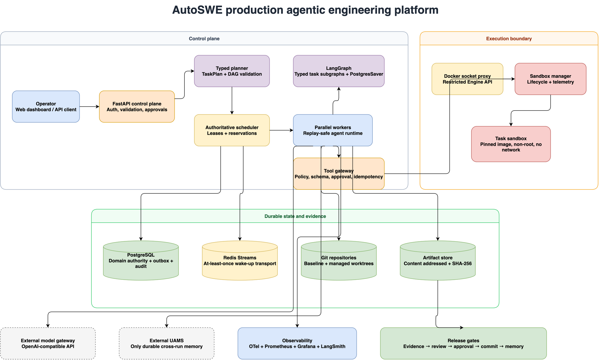
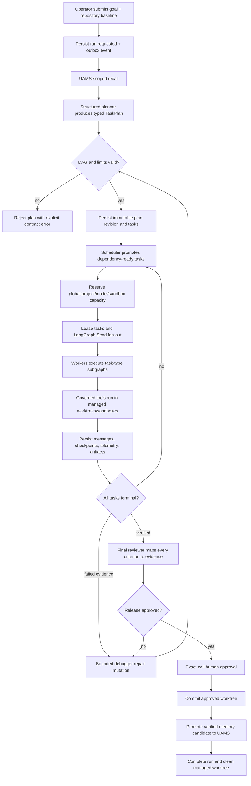
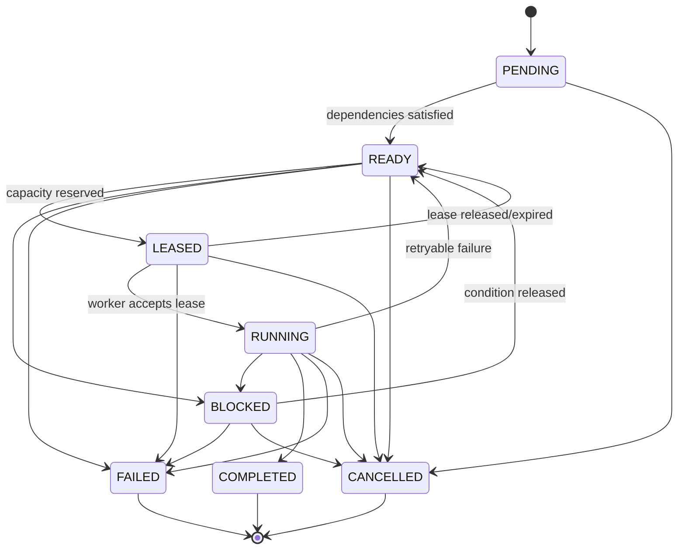
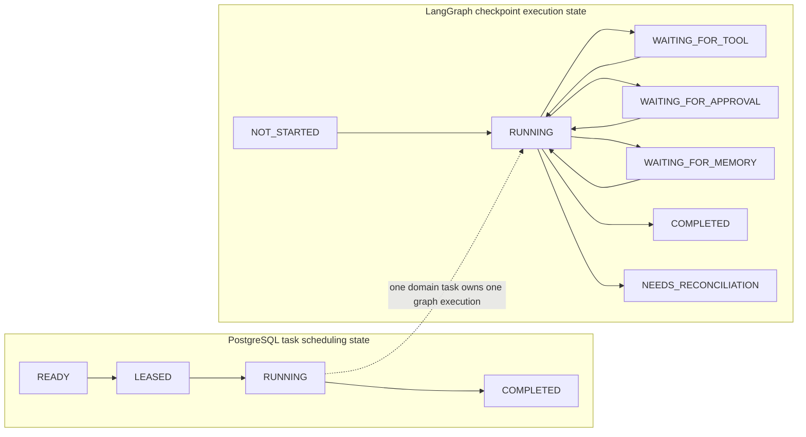
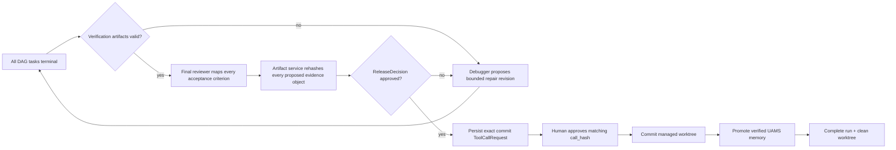

# AutoSWE

AutoSWE is a production-oriented agentic engineering platform for building and maintaining SaaS
products, applications, websites, and general software systems. A goal becomes a typed task DAG;
independent work runs concurrently; each task executes through a task-specific LangGraph workflow;
failures can add bounded repair work; and only evidence-backed, approved outcomes reach Git and
long-term memory.

The project is deliberately a coherent workflow platform rather than a collection of prompts and
agents. Planning, scheduling, workflow execution, agent reasoning, tools, sandboxes, memory,
persistence, and observability have separate responsibilities and explicit failure semantics.

> **Deployment scope:** one host running Docker Compose, connected to an already-running external
> UAMS deployment and an OpenAI-compatible model endpoint. This is a hardened single-machine
> architecture, not a distributed control plane.



The editable diagram is available as
[draw.io source](docs/assets/autoswe-architecture.drawio) and as an
[embedded SVG](docs/assets/autoswe-architecture.drawio.svg).

## Contents

- [What the platform proves](#what-the-platform-proves)
- [Architectural principles](#architectural-principles)
- [Component ownership](#component-ownership)
- [End-to-end execution](#end-to-end-execution)
- [Dynamic planning and typed task DAGs](#dynamic-planning-and-typed-task-dags)
- [Scheduler and concurrency control](#scheduler-and-concurrency-control)
- [LangGraph workflows](#langgraph-workflows)
- [Agent runtime and structured model I/O](#agent-runtime-and-structured-model-io)
- [Tool governance and sandboxing](#tool-governance-and-sandboxing)
- [Durability and state](#durability-and-state)
- [Messaging and agent communication](#messaging-and-agent-communication)
- [UAMS memory](#uams-memory)
- [Artifacts, Git, and release gates](#artifacts-git-and-release-gates)
- [Security model](#security-model)
- [Observability and SLOs](#observability-and-slos)
- [Docker Compose topology](#docker-compose-topology)
- [Quick start](#quick-start)
- [API and operator workflow](#api-and-operator-workflow)
- [Failure recovery](#failure-recovery)
- [Extending the platform](#extending-the-platform)
- [Repository map](#repository-map)
- [Verification](#verification)
- [Non-goals and limitations](#non-goals-and-limitations)

## What the platform proves

AutoSWE implements the production path for these agentic workflow capabilities:

- **Dynamic task decomposition.** A structured planner generates a typed, dependency-aware DAG from
  a goal and repository baseline. Repair can add new work without replacing the history of the
  original plan.
- **Task-specific LangGraph execution.** Research, implementation, test, refactor, documentation,
  and validation tasks use different subgraphs rather than being forced through one generic loop.
- **Stateful and durable workflows.** PostgreSQL stores domain state; LangGraph PostgresSaver stores
  resumable graph checkpoints; reconciliation resolves divergence deterministically.
- **Parallel agent execution.** The scheduler admits independent ready tasks subject to global,
  project, model, and sandbox concurrency budgets. LangGraph `Send` performs graph-level fan-out of
  scheduler-authorized dispatches.
- **Durable state and communication.** Leases, attempts, messages, events, receipts, dead letters,
  approvals, artifacts, resource use, and immutable audit records survive process restarts.
- **Structured outputs.** Plans, task mutations, tool calls, proposals, sandbox results, memory
  candidates, and release decisions are strict Pydantic contracts with unknown fields rejected.
- **Governed tool calling.** Native model tool calls pass through capability, role, risk, schema,
  path, replay, approval, and sandbox policies before execution.
- **External long-term memory.** UAMS is the only durable cross-run knowledge store. Recall is
  provenance-aware and promotion is evidence-gated and idempotent.
- **Verified delivery.** A release requires a final validation sink, direct acceptance evidence,
  artifact rehashing, final review, exact-call approval, Git commit, and memory promotion.

This project does not claim magical autonomous correctness. It makes uncertainty visible, limits
the blast radius of model decisions, and requires machine-verifiable evidence at release
boundaries.

## Architectural principles

### One authority per question

The central design decision is to avoid ambiguous ownership:

- PostgreSQL answers **what happened and what is allowed to happen next**.
- The scheduler answers **when and where a task may run**.
- LangGraph answers **where a particular workflow execution can resume**.
- The agent runtime answers **how an agent reasons within its declared contract**.
- The tool gateway answers **which side effect is allowed**.
- The sandbox answers **where code may execute and under which resource limits**.
- Git answers **which source revision exists**.
- The artifact store answers **which evidence bytes were produced**.
- UAMS answers **which verified knowledge persists across runs**.

### Replay safety, not wishful exactly-once semantics

Delivery is at least once. Every graph node must be replay-safe, and every externally visible side
effect must be idempotent or protected by an explicit transactional/idempotency boundary. If an
external side effect may have happened but cannot be proven, the execution moves to
`NEEDS_RECONCILIATION`; it is not blindly retried.

### Control and execution are different trust zones

The API, planner, scheduler, and workers do not mount the Docker socket. Only the sandbox manager
can call a restricted Docker Engine proxy. Model output is data, never source code that bypasses
tool policy.

### Evidence precedes confidence

The final reviewer cannot approve a textual claim by itself. Acceptance criteria must map to valid
artifact IDs, and the artifact service rehashes stored bytes before they can be presented as
evidence.

### Bounds are part of correctness

Parallelism, plan growth, model use, sandbox use, retries, cost, time, memory, processes, output,
and network access all have explicit ceilings. An agentic system without these bounds can turn one
planner mistake into a resource storm.

## Component ownership

| Component | Responsibility | Authoritative for | Explicitly not responsible for |
|---|---|---|---|
| FastAPI control plane | Authentication, request validation, project/run APIs, approvals, artifacts, event streaming | Accepted operator intent | Scheduling or arbitrary code execution |
| Planner | Convert a goal into `TaskPlan`; propose bounded `TaskPlanMutation` repair work | What work is proposed | Admitting resources or executing tools |
| DAG validator | Validate IDs, dependencies, acyclicity, depth, budgets, tool grants, repository scope, and final sink | Whether a plan revision is admissible | Deciding runtime order among ready tasks |
| Scheduler | Promote dependency-ready tasks, reserve capacity, lease work, heartbeat, retry, cancel | Task admission and concurrency | Agent reasoning or graph checkpoints |
| Dispatcher | Publish admitted batches and advance run finalization | Moving durable work into active delivery | Inventing tasks or bypassing leases |
| LangGraph runtime | Execute typed node sequences, interrupt, checkpoint, fan out admitted work | Graph execution cursor | Canonical domain/task status |
| Agent runtime | Invoke declared models, validate structured output, use granted tools/memory, record usage | One agent invocation | Global resource admission |
| Tool gateway | Enforce role, capability, schema, risk, path, replay, timeout, approval, and side-effect policy | Whether a tool call may execute | Deciding release success |
| Sandbox manager | Create, observe, cancel, and account for isolated task containers | Sandbox lifecycle and measured resource use | Planning or approval policy |
| PostgreSQL | Domain records, checkpoints, outbox, receipts, audit, approvals, artifact metadata, usage | Durable operational truth | Cross-run semantic knowledge |
| Redis Streams | Low-latency task/event wake-ups | Delivery position only | Business truth or unique effects |
| Artifact service | Content-addressed evidence and integrity quarantine | Evidence bytes and SHA-256 validity | Source history |
| Git/worktree manager | Baselines, isolated changes, approved commit | Code history | Evidence validity or memory truth |
| External UAMS | Recall and promotion of verified knowledge | Durable cross-run memory | Task/run state |
| Observability stack | Metrics, traces, logs, dashboards, SLO burn rate | Operational diagnosis | Domain recovery decisions |

## End-to-end execution



The baseline commit is carried through the plan, task, graph, approval, artifact, Git, and memory
boundaries. A mismatched repository identity or baseline is a reconciliation error, not a warning.

## Dynamic planning and typed task DAGs

### Plan contract

`TaskPlan` is an immutable structured model containing the run/project/repository identity,
baseline commit, revision, bounded task list, and plan limits. Each `TaskSpec` declares:

- one of six task types;
- explicit dependencies;
- capability assignment and allowed tool names;
- acceptance criteria and expected artifacts;
- repository path scope and risk ceiling;
- retry policy, budget, and resource estimate.

Planner text is never parsed as raw executable code. The model gateway requests a concrete schema,
validates the response, and can perform bounded schema repair or model fallback. A plan is not
persisted as active until deterministic validation succeeds.

### DAG invariants

The validator enforces:

- unique IDs and matching run/project/repository scope;
- dependency existence, uniqueness, and acyclicity;
- bounded maximum depth and task count;
- allowed tool and repository path policy;
- total budget/time ceilings;
- a single final `VALIDATION` sink;
- transitive coverage: every task must be an ancestor of that final sink.

The final-sink rule is important. Parallel tasks are not considered integrated merely because
each passed independently; every branch must flow into one validation task that verifies the
combined outcome.

### Dynamic repair without unbounded DAG growth

Failure evidence can invoke the debugger to propose a `TaskPlanMutation`. Mutations are append-only
revisions and must pass incremental validation before admission. The default production guards are:

| Guard | Default |
|---|---:|
| Maximum dynamically added tasks | 24 |
| Maximum plan depth | 12 |
| Maximum total run budget | USD 25 |
| Maximum total execution time | 7,200 seconds |

The repair controller also records durable revision and stage-attempt identity, so a crash cannot
silently create a second mutation for the same repair decision.

## Scheduler and concurrency control

The scheduler, not LangGraph and not the model, owns concurrency. A task moves from dependency
waiting to `READY`, then receives a capacity reservation and lease before it can be published.

Default production limits:

| Admission dimension | Environment variable | Default |
|---|---|---:|
| Total concurrent tasks | `AUTOSWE_MAX_PARALLEL_TASKS` | 8 |
| Concurrent tasks per project | `AUTOSWE_MAX_PARALLEL_TASKS_PER_PROJECT` | 4 |
| Concurrent model calls | `AUTOSWE_MAX_MODEL_CONCURRENCY` | 4 |
| Concurrent sandboxes | `AUTOSWE_MAX_SANDBOX_CONCURRENCY` | 4 |

Reservations are persisted separately from actual measured use. This supports both admission
decisions and detection of leaks or underestimation. A worker heartbeats its lease; expired leases
release reservations and make replay eligible according to retry and reconciliation policy.

Scheduler-approved dispatch messages carry stable task and lease identities. The live dispatcher
uses LangGraph `Send` for concurrent publish fan-out, then verifies deterministic fan-in by lease
token. LangGraph therefore provides graph-level parallelism without becoming an alternative
scheduler.

### Task state machine



## LangGraph workflows

### Task-type-specific subgraphs

Each task type has its own compiled graph and semantic node sequence:

| Task type | Node sequence | Intended output |
|---|---|---|
| `RESEARCH` | `recall → investigate → evidence → synthesis` | Evidence-backed findings |
| `IMPLEMENTATION` | `recall → implement → targeted_test → review` | Patch plus targeted verification |
| `TEST` | `recall → generate_tests → execute → review` | Executed test evidence |
| `REFACTOR` | `recall → establish_invariants → refactor → regression_verify → review` | Behavior-preserving change |
| `DOCUMENTATION` | `recall → draft → validate_examples → review` | Validated documentation |
| `VALIDATION` | `recall → inspect → verify → evidence` | Integration/release evidence |

This makes the workflow genuinely dynamic: the planner chooses work types and dependencies, and the
runtime selects the matching subgraph. A research task is not forced through code generation, and
a validation task cannot masquerade as implementation.

### Scheduler state is not graph state

Task state and graph execution state are deliberately stored and reasoned about separately. For
example, a domain task can remain `RUNNING` while the graph is `WAITING_FOR_APPROVAL`.



Production graphs require `AsyncPostgresSaver`; an in-memory checkpointer is rejected by production
compilation. Graph thread identity is deterministic from run, task, and attempt IDs: every lease
attempt executes its own checkpoint chain. When a new attempt starts, the durable graph row performs
an audited *attempt rollover* onto the new thread and restarts `RUNNING`; the superseded chain is
retained as checkpoint history until retention purges it. Nodes derive stable idempotency keys from
run, task, attempt, and node names, and reducers reject conflicting replay results. A completed node
result is only replayed while the content hashes of its recorded changed paths still match the task
worktree; otherwise the node re-executes.

The interrupt-capable wait states (`WAITING_FOR_TOOL`, `WAITING_FOR_APPROVAL`) and explicit resume
payloads are supported by the runtime but are not exercised by the production task subgraphs: no
production node calls `interrupt()`, and approval-gated tools called inside an agent loop are denied
with a typed failure instead of pausing. `WAITING_FOR_MEMORY` is produced only by the run-level
promotion path, not by task graph execution.

### Graph execution state machine

`RUNNING` may transition to `WAITING_FOR_TOOL`, `WAITING_FOR_APPROVAL`,
`WAITING_FOR_MEMORY`, `PAUSED`, a terminal state, or `NEEDS_RECONCILIATION`. Terminal graph states
do not transition — with one sanctioned exception: a new lease attempt rolls the execution over to a
fresh checkpoint chain as described above. `NEEDS_RECONCILIATION` requires a deterministic
operator/system decision before returning to execution or a terminal state; the reconcile CLI's
`resolve <project> <task> <fail|retry>` command provides that exit. Reconciliation also enforces
symmetric divergence rules: domain-terminal-wins over a live graph, and graph-terminal-wins (task
cancelled) when an execution was cancelled while its task remained live.

## Agent runtime and structured model I/O

Agent behavior is described by `AgentSpec`, not hidden prompt convention. A spec fixes role,
purpose, typed input/output schemas, primary/fallback models, tool grants, maximum risk, memory
policy, token/cost/turn/time budgets, sandbox and network profiles, retry policy, escalation, and
termination behavior. A canonical hash identifies the exact spec used by an attempt.

The model gateway provides:

- OpenAI-compatible chat completion and streaming support;
- declared or detected capability validation;
- native structured outputs and native tool calls;
- primary/fallback model policy;
- cancellation and wall-time enforcement;
- stable invocation/turn identity and usage deduplication;
- input, cached-input, output token, and cost accounting;
- correlation headers and trace propagation;
- transient, timeout, contract, and policy failure classification.

Model output cannot directly write files or launch commands. It must validate into a declared
contract such as `TaskPlan`, `ImplementationProposal`, `ToolCallRequest`, `MemoryCandidate`, or
`ReleaseDecision`.

## Tool governance and sandboxing

### Production tool surface

The production worker exposes four tools:

| Tool | Capability | Risk | Side effect/replay |
|---|---|---|---|
| `read_file` | `repository-read` | Low | None; replay safe |
| `search_code` | `repository-read` | Low | None; replay safe |
| `apply_patch` | `repository-write` | Medium | Local; idempotent boundary |
| `run_tests` | `verification` | Medium | Local; replay safe |

Every call is checked against the agent role, declared capability, task allowlist, argument schema,
risk ceiling, path containment, timeout, attempt count, network profile, side-effect class, and
replay policy. The registry returns typed results; it does not expose an unrestricted shell.

Commit and similarly consequential operations use a separate exact-call approval boundary. The
approval hash binds normalized arguments, project, repository, baseline, expiry, and call identity.
Changing any bound value invalidates approval.

### Sandbox boundary

The sandbox manager is a separate service. It is the only AutoSWE application with access to the
restricted Docker socket proxy. Workers call it over the internal control network.

Sandbox policy includes:

- digest-pinned Python and Node runner images;
- numeric non-root UID/GID;
- read-only root filesystem;
- all Linux capabilities dropped and `no-new-privileges` enabled;
- fixed argv arrays rather than host-shell command strings;
- network disabled by default;
- CPU, memory, PID/process, wall-time, output, and network limits;
- read-only source repository and writable per-task managed Git worktree;
- canonical path, traversal, and symlink escape checks;
- persisted container identity for cancellation and orphan cleanup.

Each `SandboxExecution` records actual CPU time, peak memory, peak and created processes, stdout and
stderr bytes, duration, network requests and bytes, exit code/reason, triggered limit, measurement
source, and whether measurement was complete. Scheduler and abuse controls can therefore compare
estimates, reservations, and real consumption.

## Durability and state

### PostgreSQL domain authority

PostgreSQL stores projects, repositories, runs, immutable plan revisions, tasks, attempts, graph
execution metadata, leases, reservations, node execution boundaries, messages, tool calls,
approvals, artifacts, model usage, memory candidates, outbox events, consumer receipts, dead
letters, state durations, and immutable audit events.

Domain writes that must publish an event commit the domain mutation, audit record, and outbox row in
one transaction. Publishers may retry indefinitely; consumers use stable event identity and durable
receipts to make effects duplicate-safe.

### Checkpoint authority

LangGraph PostgresSaver owns the resumable execution cursor and graph values. It does not overwrite
domain state. Checkpoint acknowledgements are synchronous durability boundaries in the production
workflow.

### Deterministic reconciliation

Two durable authorities can diverge after a crash, so recovery rules are explicit:

| PostgreSQL task | Graph checkpoint | Resolution |
|---|---|---|
| `RUNNING` with expired lease | Resumable | Release reservation, return task to `READY`, resume checkpoint |
| `RUNNING` | `COMPLETED` | Finalize domain task as `COMPLETED` |
| `RUNNING` | Missing | Return to `READY`; replay from persisted node boundaries |
| Terminal | Nonterminal | Domain terminal state wins; cancel graph metadata |
| Identity/baseline mismatch | Any | Quarantine as `BLOCKED` / `NEEDS_RECONCILIATION` |
| `FAILED` | `COMPLETED` | Quarantine; never infer success |

Every correction writes an immutable audit/outbox event. Reconciliation is idempotent; running it
twice should make the second pass a no-op.

### Retention

Default retention policy keeps Redis stream entries for 24 hours, agent message payloads for 90
days, resolved dead letters for 30 days, and eligible operational metadata for 365 days. Payloads
referenced by active approvals, audit evidence, or memory promotion are protected from purging.

## Messaging and agent communication

Internal agent communication uses strict message envelopes with stable IDs, schema versions,
correlation/causation identity, project/run/task/attempt scope, sender/recipient roles, timestamps,
and typed payloads.

Delivery semantics are **at least once**:

1. PostgreSQL commits the canonical event/outbox record.
2. A publisher delivers a stable event ID to Redis Streams.
3. A consumer attempts the effect and writes a durable receipt.
4. Duplicate delivery sees the receipt and does not repeat the effect.
5. Transient failure retries with bounded backoff.
6. The eighth failed delivery becomes a retained dead letter.
7. Operators can inspect and replay a dead letter after correcting the cause.

Redis loss does not erase domain truth. Outstanding canonical events can be republished. Task
dispatch additionally relies on stable lease tokens and lease expiry/recovery when a wake-up is
lost.

Google A2A is intentionally not implemented. Within this single-platform deployment, typed durable
messages provide the needed agent-to-agent communication without adding a second interoperability
protocol or authority model.

## UAMS memory

UAMS is an external service and the only durable cross-run memory. Docker Compose neither starts
UAMS nor owns its storage. There is no SQLite or in-process fallback that can silently create a
second memory authority.

Expected endpoints:

- `GET /ready`
- `POST /search`
- `POST /remember`
- `GET /memory/status/{memory_id}`

### Recall

Recall is scoped to project and, where available, repository and baseline commit. Accepted memories
must include memory/revision/source identity, observation and verification times, provenance,
evidence hashes, and originating run/task/attempt/message IDs. Expired memories and commit-scoped
knowledge that no longer matches the repository baseline are excluded.

UAMS unavailability becomes visible `WAITING_FOR_MEMORY` state. The runtime never substitutes an
empty recall result and pretends memory succeeded.

### Promotion gate

Only distilled knowledge from a verified outcome is eligible for promotion. The gate requires:

- valid artifact evidence and successful verification commands;
- semantic, episodic, or procedural classification;
- sufficient structure, evidence, and confidence;
- freshness and full source provenance;
- no detected credential, email, sensitive content, duplicate, or contradiction;
- human approval for cross-project or identity/preference/security knowledge.

The memory ID is UUIDv5 over project, source, type, normalized content, and schema. `remember()` is
therefore idempotent across a write-then-crash retry. Promotion completes only when UAMS reports the
latest revision active, indexed, and searchable. The original UAMS wait clock is preserved across
retries.

See [docs/uams-integration.md](docs/uams-integration.md) for the full adapter contract and failure
behavior.

## Artifacts, Git, and release gates

### Artifacts are evidence, not attachments

Artifact bytes are written under a controlled root and keyed by a server-computed SHA-256. Metadata
records project, run/task provenance, media type, byte size, state, and verification time. Retrieval
rehashes the storage object and never follows a user-controlled symlink.

If bytes do not match metadata:

- artifact state becomes `CORRUPT`/`QUARANTINED`;
- the object is not returned as valid evidence;
- audit and delivery events record the incident;
- final review fails instead of trusting stale metadata.

### Git isolation

Repositories are registered only from inside the configured import root. AutoSWE verifies the
baseline commit and creates managed per-task/per-run worktrees under its runtime root. Source
repositories remain read-only to execution sandboxes.

Repository adapters translate high-level checks into fixed argv commands. Python and Node adapters
detect the project toolchain, build lint/type/test/build commands, and select the pinned execution
image. New ecosystems extend this adapter contract rather than teaching agents to invent shell
commands.

### Finalization sequence



This sequence prevents a reviewer from approving missing evidence, an approval from authorizing a
changed command, a corrupted artifact from being displayed as valid, or an unverified outcome from
becoming durable memory.

## Security model

### Trust boundaries

- The administrator bearer token controls the loopback-bound API.
- PostgreSQL and internal audit data are trusted as domain authority.
- Redis is treated as untrusted delivery transport.
- Model providers and UAMS are external dependencies whose responses require strict validation.
- The tool gateway and sandbox—not model obedience—are the prompt-injection enforcement boundary.
- The sandbox manager and restricted socket proxy form the Docker-daemon boundary.
- Host root or Docker daemon compromise defeats container isolation.

### API controls

- constant-time administrator token comparison;
- explicit CORS origins; wildcard origins rejected;
- bounded request bodies and per-minute rate limiting;
- `no-store` and defensive security headers;
- scoped UUID queries and redacted delivery errors;
- separate liveness and dependency-aware readiness;
- exact-call approval binding;
- authenticated WebSocket event streams.

### Container and network controls

Application containers run as non-root with read-only filesystems, dropped capabilities,
`no-new-privileges`, bounded tmpfs, health checks, restart policies, and resource limits. Only API
and web ports bind to host loopback. PostgreSQL, Redis, sandbox manager, socket proxy, Prometheus,
and the OpenTelemetry collector have no public host ports.

Compose networks separate edge traffic, internal control traffic, Docker API access, and external
model/UAMS egress. Workers have no Docker socket mount; the proxy exposes only the Engine operations
needed by the sandbox manager.

### Secrets

Secrets enter through runtime environment variables and are represented as secret values in
settings. Structured logging recursively redacts secret-key names and embedded bearer/token/
password patterns. Correlation IDs—not request bodies containing secrets—cross service boundaries.

If any credential has ever entered Git history, rotate it. Removing it from the current Compose
file is insufficient.

The detailed threat model and operator responsibilities are in
[docs/security-model.md](docs/security-model.md).

## Observability and SLOs

### Correlation model

API requests, planning, scheduling, graph execution, agent/model calls, tool calls, sandboxes,
artifacts, messages, and UAMS calls propagate the relevant request, trace, run, project, repository,
task, attempt, graph, tool, artifact, and memory IDs. This makes a single task traceable across
process and storage boundaries.

### Time in state

The platform records and exports:

- `task_state_duration_seconds`
- `workflow_state_duration_seconds`
- `approval_wait_duration_seconds`
- `uams_wait_duration_seconds`

These answer the operational question “why is this task not progressing?” without reconstructing a
timeline from logs. Dashboards also cover queue depth, dispatch/event latency, lease age, retries,
dead letters, resource reservations versus actual use, sandbox outcomes, artifact integrity, model
usage/cost, and SLO burn rate.

### Initial service-level objectives

These are explicit starting targets to benchmark and revise, not claims about measured historical
availability:

| SLO | Target over 30 days | Eligible population |
|---|---|---|
| API availability | 99.5% | Authenticated requests excluding explicit client errors and maintenance |
| Task dispatch latency | 95% below 2 seconds | `READY` tasks with scheduler capacity |
| Checkpoint durability | 99.99% | Acknowledged synchronous checkpoint writes |
| Event delivery latency | 99% below 5 seconds | Committed outbox events while Redis is available |
| Approval notification latency | 95% below 5 seconds | Committed approvals with active notification channel |
| Cancellation propagation | 99% below 10 seconds | Accepted cancellation of active workers/sandboxes |
| Artifact integrity | 100% | Artifacts presented as verified evidence |
| Worker failure recovery | 95% below 60 seconds | Failures with checkpoint and retry budget |

Fast and slow burn-rate thresholds are 14.4 and 6.0. The optional observability overlay adds an
OpenTelemetry collector, Prometheus, and provisioned Grafana dashboards. LangSmith tracing remains
runtime-configurable and is not an operational state authority.

## Docker Compose topology

The base stack is intentionally deployable on one machine:

| Service | Role | Durable volume/host exposure |
|---|---|---|
| `postgres` | Domain database and LangGraph checkpoint store | `postgres-data`; no host port |
| `redis` | Streams wake-up transport | `redis-data`; no host port |
| `docker-socket-proxy` | Restricted Docker Engine API | Docker socket; internal only |
| `sandbox-manager` | Sandbox lifecycle and telemetry | Controlled runtime bind; internal only |
| `migrations` | One-shot Alembic upgrade and drift check | None |
| `api` | Authenticated control plane | Loopback `8080` by default |
| `dispatcher` | Planning, scheduling, outbox/finalization advancement | None |
| `workers` | Parallel task/LangGraph/agent execution | Controlled runtime bind |
| `web` | Static operational dashboard | Loopback `3000` by default |

Optional overlay services:

| Service | Role |
|---|---|
| `otel-collector` | Receive and process OTLP telemetry |
| `prometheus` | Scrape/store operational metrics |
| `grafana` | Provisioned reliability dashboard, loopback-bound |

UAMS and the model endpoint are deliberately external. For services running on the Docker host,
containers use `host.docker.internal`, not `localhost`.

## Quick start

### Prerequisites

- Docker Engine with Compose v2
- Git, OpenSSL, and curl
- Python 3.12+ for local development commands; recreate older virtual environments after upgrading
- an already-running UAMS service reachable from containers
- an OpenAI-compatible model endpoint reachable from containers

### 1. Generate local secrets and runtime directories

```bash
./scripts/init-admin-token.sh
```

This creates `.env` with mode `0600`, generates administrator/PostgreSQL/Grafana credentials, and
creates protected `runtime/{artifacts,worktrees,imports,backups}` directories. It refuses to
overwrite an existing `.env`.

### 2. Configure external dependencies

Edit `.env` and set at minimum:

```dotenv
AUTOSWE_UAMS_URL=http://host.docker.internal:8000
AUTOSWE_UAMS_TOKEN=
AUTOSWE_MODEL_BASE_URL=http://host.docker.internal:11434/v1
AUTOSWE_MODEL_API_KEY=
AUTOSWE_MODEL_PRIMARY=qwen3-coder
```

The exact model is configurable; the production runtime requires the declared capabilities used by
the agent specs. Never commit `.env`.

### 3. Import a repository

```bash
git clone /path/to/source runtime/imports/my-saas
git -C runtime/imports/my-saas rev-parse HEAD
```

Only repositories beneath `AUTOSWE_HOST_RUNTIME_ROOT/imports` can be registered.

### 4. Build and start

```bash
docker compose build api web
docker compose up -d postgres redis docker-socket-proxy sandbox-manager migrations
docker compose up -d api dispatcher workers web
docker compose ps
curl --fail http://127.0.0.1:8080/health/ready
```

Open the dashboard at [http://127.0.0.1:3000](http://127.0.0.1:3000).

Readiness checks PostgreSQL, Redis, checkpoint tables, sandbox manager, model configuration, and
UAMS. Liveness only establishes that the API process is alive.

### 5. Optional observability stack

```bash
docker compose -f docker-compose.yml -f docker-compose.observability.yml up -d
```

## API and operator workflow

Load the token without printing it:

```bash
set -a
. ./.env
set +a
BASE=http://127.0.0.1:8080/api/v1
AUTH="Authorization: Bearer $AUTOSWE_ADMIN_TOKEN"
```

### Register a repository

```bash
curl --fail --header "$AUTH" --header 'Content-Type: application/json' \
  --data '{"name":"my-saas","source_path":"/absolute/path/to/runtime/imports/my-saas","default_branch":"main"}' \
  "$BASE/projects"
```

Retain the returned `project_id` and `repository_id`.

### Submit a run

```bash
curl --fail --header "$AUTH" --header 'Content-Type: application/json' \
  --data '{"project_id":"PROJECT_UUID","repository_id":"REPOSITORY_UUID","goal":"Build the requested feature with tests","baseline_commit":"40_HEX_COMMIT"}' \
  "$BASE/runs"
```

### Inspect and control

| Method and route | Purpose |
|---|---|
| `GET /runs/{run_id}` | Run state, time in state, plan revision, task counts, model usage/cost |
| `GET /runs/{run_id}/tasks` | Typed DAG tasks and states |
| `GET /runs/{run_id}/approvals` | Pending/decided exact-call approvals |
| `GET /runs/{run_id}/artifacts` | Evidence metadata and integrity state |
| `GET /runs/{run_id}/events` | Ordered immutable audit timeline |
| `POST /projects/{project_id}/tasks/{task_id}/cancel` | Accept task cancellation |
| `POST /approvals/{approval_id}/decision` | Approve/reject using expected call hash |
| `GET /projects/{project_id}/artifacts/{artifact_id}` | Download only after integrity verification |
| `GET /dead-letters` | Inspect unresolved or historical delivery failures |
| `POST /dead-letters/{id}/replay` | Replay after correcting the cause |
| `WS /projects/{project_id}/tasks/{task_id}/events` | Authenticated task event stream |

Approval example:

```bash
curl --fail --header "$AUTH" --header 'Content-Type: application/json' \
  --data '{"approved":true,"approver":"operator","expected_call_hash":"64_HEX_HASH"}' \
  "$BASE/approvals/APPROVAL_UUID/decision"
```

The expected hash must exactly match the pending approval returned by the API.

For the full runbook, see [docs/operator-guide.md](docs/operator-guide.md).

## Failure recovery

| Failure | Durable behavior | Recovery path |
|---|---|---|
| Worker crash | Lease, attempt, node boundary, and checkpoint remain | Lease expiry + reconciliation requeue the task; the next attempt replays on a fresh checkpoint chain, honoring durable node results only where worktree fingerprints still match |
| Sandbox-manager crash | Container identity was persisted before start | Startup reaps orphans and records interruption |
| Redis loss | PostgreSQL domain/outbox records remain | Restart transport; republish canonical events; receipts suppress duplicates |
| UAMS unavailable | Graph/candidate wait visibly in `WAITING_FOR_MEMORY` | Restore UAMS; deterministic memory ID resumes same operation |
| Model timeout/transient failure | Attempt and usage identity remain | Bounded retry/fallback within agent budget |
| Unknown external side effect | Outcome cannot safely be inferred | Quarantine as `NEEDS_RECONCILIATION`; do not retry blindly |
| Artifact corruption | Rehash fails and object is quarantined | Recreate evidence or restore matching DB/artifact backup epoch |
| Domain/checkpoint divergence | Both states remain independently durable | Deterministic reconciliation matrix; immutable correction event |
| Migration failure | Verified pre-change backup exists | Reversible downgrade when supported, otherwise full restore |

Routine recovery commands:

```bash
docker compose ps
docker compose logs --since 30m api dispatcher workers sandbox-manager postgres redis
./scripts/reconcile.sh
./scripts/backup.sh
```

Restore is intentionally disruptive and explicit:

```bash
./scripts/restore.sh --confirm /absolute/path/to/autoswe.dump
```

Restore verifies the SHA-256 sidecar and dump catalog, creates a pre-restore safety backup, stops
writers, restores with `--exit-on-error`, reruns migrations, and restarts services.

See [docs/recovery-guide.md](docs/recovery-guide.md) before incident response or upgrade rollback.

## Extending the platform

### Add a repository ecosystem

Implement the repository adapter protocol, provide deterministic detection and fixed argv for
install/lint/type/test/build operations, bind it to a digest-pinned runner image, register it in the
adapter registry, and add adapter contract plus sandbox integration tests. See
[docs/repository-adapters.md](docs/repository-adapters.md).

### Add a tool

Define strict argument and result models, assign one owning capability, enumerate eligible roles,
set base risk, side-effect and replay classes, path fields, timeout, attempt limit, sandbox/network
profiles, and approval requirements. Register only a typed executor. Add policy denial, replay, path
containment, evidence, and sandbox tests before granting it to a planner.

### Add a task type

Add the enum value and structured planning contract, define a semantic node sequence, compile its
subgraph with production checkpointer enforcement, implement node execution behavior, update final
sink/repair policy if necessary, and add contract, graph, scheduler, and deterministic E2E coverage.

### Add a model provider

Keep the gateway port stable. Implement capability discovery/declaration, structured output and
native tool calling, streaming cancellation, normalized usage accounting, error classification,
correlation propagation, and replay-safe call identity. Model-specific behavior must not leak into
the scheduler or domain contracts.

### Replace local artifact storage

Preserve the artifact port: server-computed hash, project scope, immutable metadata, verified get,
quarantine, and audit events. An object-store implementation must retain the same integrity and
evidence semantics.

### Scale beyond one machine

Do not merely increase Compose replicas. A distributed deployment needs an explicit design for
distributed sandbox placement, leader election or partitioned dispatch, shared artifact/worktree
storage, network policy, host identity, cross-node cancellation, and operational ownership. The
domain/scheduler/message ports are intended to make that future replacement possible, but it is not
implemented here.

## Repository map

```text
agents/                    Agent specs, runtime, model gateway, usage boundaries
apps/api/                  Authenticated control-plane API and WebSocket events
apps/dispatcher/           Planning, scheduling, publication, finalization loop
apps/worker/               Task lease consumer and production node execution
apps/sandbox_manager/      Restricted Docker sandbox service
apps/web/                  Operational dashboard
domain/                    Frozen typed contracts, enums, events, messages
execution/repositories/    Python/Node repository adapters
execution/sandbox/         Policies, runner, manager client, Git worktrees
execution/scheduler/       Admission, leases, reservations, reconciliation
infrastructure/            Settings, migration/reconcile entrypoints, telemetry configs
knowledge/memory/          UAMS port, adapter, freshness, promotion gate
messaging/                 Outbox, Redis Streams, consumers, receipts, retention
migrations/                PostgreSQL/Alembic schema evolution
observability/             Structured logging, metrics, tracing, SLO definitions
persistence/               Database tables/repositories, artifacts, model usage
planning/                  Structured planning service and DAG validator
policies/                  Agent/tool policy configuration
tools/                     Tool contracts, registry, approvals, production executors
workflows/                 LangGraph state, subgraphs, repair, review, finalization
tests/                     Unit, property, contract, integration, failure, migration, E2E
scripts/                   Bootstrap, migrate, backup, restore, reconcile, smoke
```

## Verification

### Local development environment

The lock files were generated with Python 3.14 and the package supports Python 3.12 through 3.14.
Archive or remove any older virtual environment, then create a locked development environment:

```bash
uv venv --python 3.14 .venv
uv pip sync --python .venv/bin/python requirements-dev.lock
```

Use `requirements.lock` instead when only runtime dependencies are required.

### Fast development gates

```bash
.venv/bin/ruff check .
.venv/bin/mypy domain planning persistence messaging knowledge agents workflows tools execution apps observability infrastructure
.venv/bin/pytest tests/unit tests/property tests/contract -q
.venv/bin/pytest tests/integration tests/security tests/failure tests/migration -q
.venv/bin/pytest tests/e2e/test_scripted_production_workflow.py -q
docker compose config --quiet
docker compose -f docker-compose.yml -f docker-compose.observability.yml config --quiet
```

### Full acceptance gate

```bash
.venv/bin/pytest -q
./scripts/smoke.sh
```

The deterministic E2E uses scripted model responses but the real planner, PostgreSQL scheduler,
Redis Streams, three parallel workers, LangGraph PostgresSaver, governed tools, Docker sandbox, Git
worktrees, artifacts, approval, final reviewer, and UAMS adapter. Its scenario deliberately covers:

```text
parallel research + implementation + test
                    ↓
             integration validation
                    ↓
       intentional sandboxed test failure
                    ↓
           debugger repair plan mutation
                    ↓
        new final validation and evidence
                    ↓
       release review → approval → Git → UAMS
```

Failure and migration suites additionally prove:

- deterministic PostgreSQL/checkpoint divergence resolution;
- worker death and replay-safe recovery;
- Redis loss with canonical outbox recovery;
- UAMS write-then-crash idempotency and wait-duration preservation;
- corrupted artifact detection and release rejection;
- checkpoint resume through schema upgrade and reversible rollback;
- backup hash/catalog verification and actual restore during smoke testing.

## Non-goals and limitations

- **No Google A2A yet.** Internal typed durable messaging covers current agent communication.
- **No distributed multi-host control plane.** The supported deployment is one Docker Compose host.
- **No autonomous deployment or infrastructure mutation.** The production tool surface is scoped to
  repository work and verification; consequential Git action requires approval.
- **No arbitrary host shell.** Commands are adapter-generated argv arrays executed in constrained
  containers.
- **No SQLite/in-memory production fallback.** PostgreSQL, Redis transport, PostgresSaver, and
  external UAMS failures are visible instead of silently changing authorities.
- **No guarantee against host/Docker compromise.** Use a dedicated, patched machine with encrypted
  disks/backups for untrusted repositories.
- **No guarantee that model reasoning is correct.** Structured contracts, policy, isolation, and
  evidence gates limit and detect failures; they do not make an LLM infallible.
- **No claim that initial SLOs are achieved before measurement.** They are operational targets to
  validate under representative load.

## Further documentation

- [Operator guide](docs/operator-guide.md): bootstrap, runs, approvals, observability, upgrades
- [Recovery guide](docs/recovery-guide.md): reconciliation, worker/Redis/UAMS/artifact/database loss
- [Security model](docs/security-model.md): trust boundaries, controls, residual risk
- [External UAMS integration](docs/uams-integration.md): recall, promotion, idempotency, failures
- [Repository adapters](docs/repository-adapters.md): adding language/toolchain support
- [Production implementation plan](docs/superpowers/plans/2026-08-13-production-agentic-platform.md):
  acceptance rationale and implementation trace

Never commit `.env`, runtime artifacts, imported repositories, generated worktrees, or backups.
