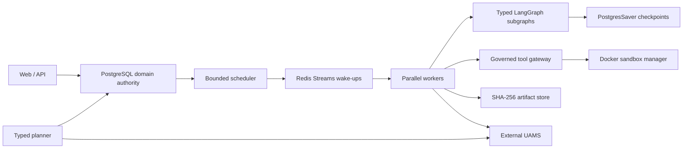

# AutoSWE production agentic engineering platform

AutoSWE is a production-oriented, single-machine agentic workflow engine for building and
maintaining software. It dynamically decomposes a goal into a typed task DAG, admits bounded
parallel work, executes task-specific LangGraph subgraphs with PostgreSQL checkpoints, verifies
artifacts, repairs failures, pauses for exact-call approval, and promotes verified knowledge to
an external UAMS deployment.

The production engine is authoritative. There is no SQLite fallback, fixed planner, host shell
executor, raw-code parser, or hard-coded code generator. Google A2A is intentionally out of scope;
durable typed messages plus the PostgreSQL outbox provide internal agent communication.

## Architecture



PostgreSQL owns what happened and whether work may run. LangGraph checkpoints own where a graph
can resume. A deterministic reconciliation matrix resolves divergence between those two states.
Redis is disposable transport; committed outbox rows are the recovery source.

## Quick start

Requirements: Docker Engine with Compose v2, Git, OpenSSL, curl, and an already-running UAMS
service reachable from containers. The default external URL is `http://host.docker.internal:8000`.

```bash
./scripts/init-admin-token.sh
# Edit .env: set the external UAMS URL/token and OpenAI-compatible model URL/key/model.
mkdir -p runtime/imports
docker compose build api web
docker compose up -d postgres redis docker-socket-proxy sandbox-manager migrations
docker compose up -d api dispatcher workers web
curl --fail http://127.0.0.1:8080/health/ready
```

Open the dashboard at [http://127.0.0.1:3000](http://127.0.0.1:3000). The API is bound to
`127.0.0.1:8080`. Put source repositories below the configured
`AUTOSWE_HOST_RUNTIME_ROOT/imports`; the API rejects paths outside that root.

Run the deterministic production-path acceptance scenario:

```bash
./scripts/smoke.sh
```

It verifies Compose readiness, database backup and restoration, branching parallel execution,
an intentional integration failure, dynamic repair, sandboxed tests, artifact hashes, approval,
Git commit, and UAMS promotion.

## What is implemented

- Six task types with distinct subgraphs: research, implementation, test, refactor,
  documentation, and validation.
- Incrementally validated dynamic DAG mutations with task, depth, budget, time, and no-progress
  guards.
- Scheduler-owned global, project, model, and sandbox concurrency reservations.
- Replay-safe nodes and explicit idempotency/uncertain-side-effect boundaries.
- PostgreSQL migrations, immutable audit events, leases, attempts, messages, outbox, receipts,
  dead letters, approvals, artifacts, usage, sandbox telemetry, and state durations.
- At-least-once Redis Streams delivery with duplicate-safe consumers and canonical recovery.
- Structured model outputs, native typed tool calls, schema repair, usage/cost accounting, and
  model fallbacks.
- External UAMS recall plus gated, idempotent promotion with freshness and provenance.
- Digest-pinned, non-root, read-only Compose services and constrained Python/Node sandboxes.
- Prometheus, OpenTelemetry, Grafana dashboards, time-in-state metrics, and initial SLOs.

See [operator-guide.md](docs/operator-guide.md), [recovery-guide.md](docs/recovery-guide.md),
[security-model.md](docs/security-model.md), [uams-integration.md](docs/uams-integration.md), and
[repository-adapters.md](docs/repository-adapters.md).

## Development verification

```bash
.venv/bin/ruff check .
.venv/bin/mypy domain planning persistence messaging knowledge agents workflows tools execution apps observability infrastructure
.venv/bin/pytest tests/unit tests/property tests/contract -q
.venv/bin/pytest tests/integration tests/security tests/failure tests/migration -q
.venv/bin/pytest tests/e2e/test_scripted_production_workflow.py -q
docker compose config --quiet
```

Never commit `.env`, runtime artifacts, imported repositories, generated worktrees, or backups.
